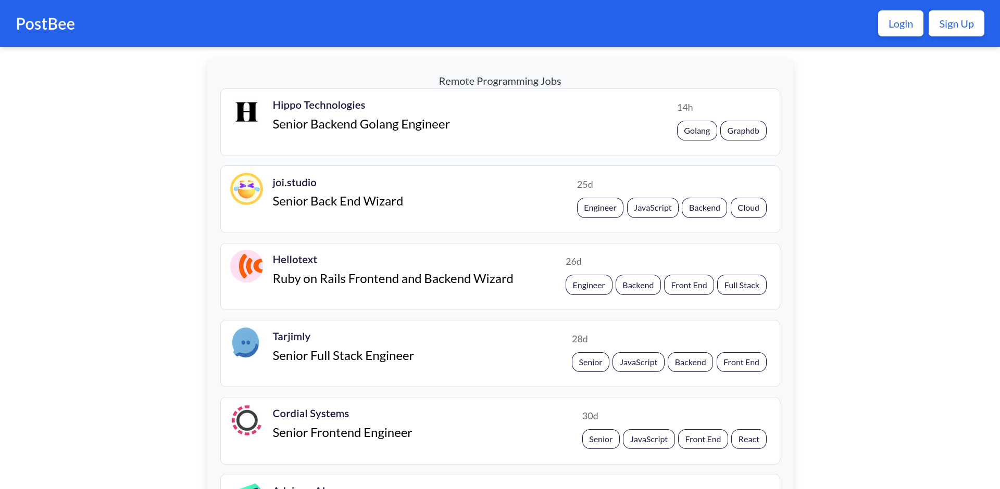

# PostBee

PostBee is a dynamic job posting platform designed to streamline the process of job management for both employers and job seekers. The application enables users to seamlessly create, manage, and apply for job postings while ensuring a user-friendly experience.



[PostBee Deployment on Netlify](https://postbee.netlify.app/)

### Backend
- [Postbee API](https://github.com/Bluette1/postbee-api)
- [Postbee Tracker API](https://github.com/Bluette1/postbee-tracker-api)

## Key Features

- **User Authentication**:
  - Secure sign-up, login, and logout functionalities to protect user accounts.
- **Job Posting**:
  - Employers can easily create and manage job listings with essential details.
- **Responsive Design**:
  - Built with TailwindCSS, PostBee offers a modern, responsive interface that adapts to various devices.
- **Intuitive UI**:
  - A clean and user-friendly layout that simplifies navigation and enhances user engagement.

## Technologies Used

### Frontend

- **AngularJS**
- **TypeScript**
- **TailwindCSS**

### Backend

- **Ruby on Rails**
- **Python (Flask)**

### Database

- **MongoDB**

### Microservices

- **Docker**
- **Pika**
- **RabbitMQ**
- **Bunny**
- **SideKiq**
- **Celery**

## Installation

To set up the PostBee project locally, follow these steps:

1. **Clone the repository**:

   ```bash
   git clone https://github.com/Bluette1/postbee.git
   cd postbee
   ```

2. **Install the necessary dependencies**:

   ```bash
   npm install
   ```

3. **Start the development server**:

   ```bash
   ng serve
   ```

4. **Open your browser** and navigate to `http://localhost:4200` to view the app.

## Usage

### For Employers:

- Sign up and create job listings.
- Manage your postings easily through your dashboard.

### For Job Seekers:

- Browse job postings.
- Apply for positions and manage your applications through your profile.

## Contributing

We welcome contributions to PostBee! Here's how you can help:

1. **Fork the repository**.
2. **Create a new feature branch**:
   ```bash
   git checkout -b feature/YourFeature
   ```
3. **Commit your changes**:
   ```bash
   git commit -m 'Add some feature'
   ```
4. **Push to the branch**:
   ```bash
   git push origin feature/YourFeature
   ```
5. **Open a Pull Request**.

## License

This project is licensed under the MIT License. See the [LICENSE](LICENSE) file for details.

## Acknowledgments

- Inspired by the need for efficient job management solutions.
- Thanks to all contributors and users for their feedback and support.

## Contact

For inquiries, please reach out to the project maintainer at marylene.sawyer@gmail.com.
